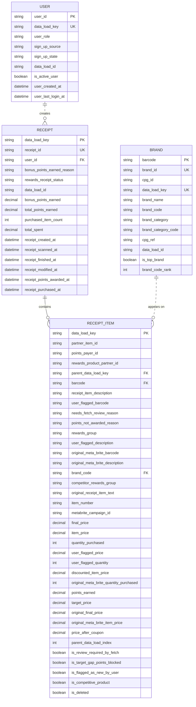

## Technical Assessment Alpha

This repo demonstrates how I approach data projects, reason about data, and communicate my understanding of a dataset.

## Prerequisites
- [Docker Desktop](https://www.docker.com/)
- [VS Code](https://code.visualstudio.com/)
- Dev Containers extension (Identifier: `ms-vscode-remote.remote-containers`)
- Create an environment variable `LOCAL_DATA_PATH` for the path to the folder containing the raw data you want to load, transform, and analyze. This folder will be mounted to the dev container.

## Getting Started

For the project to run, the assessment's sample data files must be downloaded and staged locally in the `alpha` folder:

```
LOCAL_DATA_PATH
  alpha
    brands.json.gz
    receipts.json.gz
    users.json.gz
```

These files are not included in this repo.

### Patching `users.json`

The `users.json` file is corrupt and must be manually patched:

1. Unzip `users.json.gz` to `users.json`.
2. Create `temp_users.json` and manually copy/paste the contents from `users.json`.
3. Delete `users.json.gz` and `users.json`.
4. Rename `temp_users.json` to `users.json`.

### Running the Project

1. Clone this repository.
2. Open the repository in VS Code.
3. **Reopen in Container**.
4. Open **View > Terminal**.
5. Run: ```make run```

### Notes

- The corrupt `users.json` file was an interesting challenge. Initially, I tried fixing it with Python, but the issue wasn't obvious. Troubleshooting revealed that the data itself was fine, so I applied a manual patch.
- I used local branches and squashed commits before merging/pushing to `main`. If I had used pull requests, I would have used draft PRs and squashed commits.

## Entity Relationship Diagram



### Notes

- Instead of manually inspecting unstructured data, I prioritized loading it into DuckDB to begin modeling in dbt.
- I prefer learning datasets by creating staging models, iterating on production deliverables simultaneously.
- The diagram was created after my initial staging models and updated as I refined them.

## Stakeholder Questions

### Queries

- [Top Brands by Receipts Scanned (Most Recent Month)](dbt/analyses/top_brands_by_receipts_scanned__most_recent_month.sql)
- [Rewards Receipt Status: Finished vs. Rejected](dbt/analyses/rewards_receipt_status__finished_vs_rejected.sql)
- [Top Brands by Spend and Receipts (Users Created in Last Six Months)](dbt/analyses/top_brands_by_spend_and_receipts__user_created_in_last_six_months.sql)

### Notes

- Once I created the One Big Table (OBT) core model, analysis queries were straightforward.
- I considered creating additional core models referencing the OBT but deemed it out of scope.
- The dbt Power User extension makes model and analysis creation easy, allowing iterative query execution with `CTRL + Enter`.

## Data Quality Issues

### Queries

- [Duplicate Users](dbt/analyses/data_quality__duplicate_users.sql)
- [Missing Users](dbt/analyses/data_quality__missing_users.sql)
- [Duplicate Barcodes](dbt/analyses/data_quality__duplicate_barcodes.sql)
- [Missing Barcodes](dbt/analyses/data_quality__missing_barcodes.sql)

### Notes

- Identifying and addressing data quality issues while creating staging models is second nature to me, following my usual routine of scrubbing, deduplicating, and implementing data tests.
- As I built the core model and analysis queries, I refined the staging models and gained a better understanding of major vs. minor issues.

## Email to Stakeholder

Subject: Data Updates and Open Questions

Hi [Stakeholder Name],

I've been working on answering your outstanding questions while also building a single source of truth to support future self-service data marts. This is the first iteration, so please review the attached CSV samples and share feedback so we can refine it further:

- **Top brands by receipts scanned**
    ```
    "receipt_scanned_month","brand_code","brand_rank","receipt_count","prev_brand_rank","prev_receipt_count"
    "2021-02","BRAND",1,3,10,19
    "2021-02","MISSION",2,2,13,16
    "2021-02","VIVA",3,1,,
    ```
- **Receipts with `rewardsReceiptStatus` (Accepted vs. Rejected)**
    ```
    "rewards_receipt_status","avg_total_spent","sum_purchased_item_count"
    "FINISHED",80.85430501930502,8184
    "REJECTED",23.32605633802817,173
    ```
- **Top brands for users created in the last six months**
    ```
    "brand_code","sum_final_price","sum_final_price_rank","receipt_count","receipt_count_rank"
    "BEN AND JERRYS",1217.4,1,17,2
    "BRAND",200,17,20,1
    ```

I also have a few questions before creating engineering tickets and would appreciate your input:

- **`rewardsReceiptStatus`**: Please confirm that we are comparing Finished vs. Rejected?
- **Corrupt `users.json` sample**: I manually patched it, but we need to identify the root cause.
- **Duplicate or missing users**: Are these known issues? I implemented a workaround for duplicates, but missing users will affect our analyses.
- **Duplicate or missing barcodes in the brands table**: Are these known issues? I handled duplicates, but I think missing barcodes are a major issue, so I added temporary mitigations and data quality warnings.

If these issues are minor, we can move forward with releasing the changes as-is. I structured the single source of truth using the One Big Table approach, but I have some concerns about production performance. We can explore adding incremental logic if needed.

Let me know if you’d like to discuss async on Slack or hop on a quick call.

Thanks,<br>
Curtis

### Notes

- I maintained a running list of key points to mention in the stakeholder email, making the final write-up straightforward.
