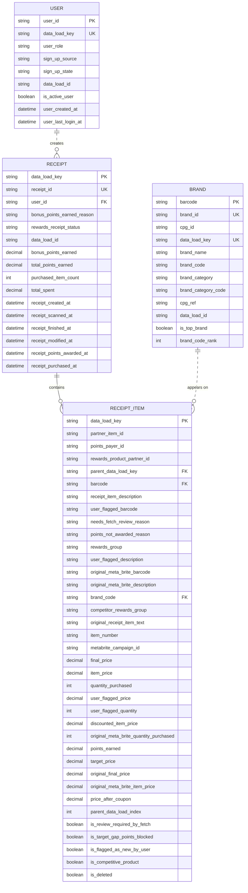

## Analytics Engineering Template

This template helps apply [analytics engineering](https://www.getdbt.com/blog/what-is-analytics-engineering) best practices when working with raw data on your local machine, such as financial statements downloaded as CSV. It can also be used for technical assessments when interviewing for data jobs.

## Prerequisites
- [Docker Desktop](https://www.docker.com/)
- [VS Code](https://code.visualstudio.com/)
- Dev Containers extension (Identifier: `ms-vscode-remote.remote-containers`)
- Create an environment variable `LOCAL_DATA_PATH` for the path to the folder containing the raw data you want to load, transform, and analyze. This folder will be mounted to the dev container.

## Demo
1. Use this template to create a repository.
2. Clone your new repository.
3. Open the repository in VS Code.
4. **Reopen in Container**.
5. Open **View > Terminal**.
6. Run: ```make run```

## Original Inspiration
- [Modern Data Stack in a Box](https://duckdb.org/2022/10/12/modern-data-stack-in-a-box.html)
- [nba-monte-carlo](https://github.com/matsonj/nba-monte-carlo)

## Other Inspirations
- [dbt-labs/jaffle-shop](https://github.com/dbt-labs/jaffle-shop)
- [jwills/nba_monte_carlo](https://github.com/jwills/nba_monte_carlo)
- [l-mds/local-data-stack](https://github.com/l-mds/local-data-stack)

## Tools Used
- [dbt-core](https://github.com/dbt-labs/dbt-core)
- [dbt-duckdb](https://github.com/duckdb/dbt-duckdb)
- [dlt](https://github.com/dlt-hub/dlt)
- [duckdb](https://github.com/duckdb/duckdb)
- [harlequin](https://github.com/tconbeer/harlequin)
- [sqlfluff](https://github.com/sqlfluff/sqlfluff)
- [sqlfmt](https://github.com/tconbeer/sqlfmt)
- [vscode-dbt-power-user](https://github.com/AltimateAI/vscode-dbt-power-user)

## Entity Relationship Diagram



## Email to Stakeholder

Subject: Data Updates and Open Questions

Hi [Stakeholder Name],

I've been working on answering your outstanding questions while also building a single source of truth to support future self-service data marts. This is the first iteration, so please review the attached CSV samples and share feedback so we can refine it further:

- **Top brands by receipts scanned**
    ```
    "receipt_scanned_month","brand_code","brand_rank","receipt_count","prev_brand_rank","prev_receipt_count"
    "2021-02","BRAND",1,3,10,19
    "2021-02","MISSION",2,2,13,16
    "2021-02","VIVA",3,1,,
    ```
- **Receipts with `rewardsReceiptStatus` (Accepted vs. Rejected)**
    ```
    "rewards_receipt_status","avg_total_spent","sum_purchased_item_count"
    "FINISHED",80.85430501930502,8184
    "REJECTED",23.32605633802817,173
    ```
- **Top brands for users created in the last six months**
    ```
    "brand_code","sum_final_price","sum_final_price_rank","receipt_count","receipt_count_rank"
    "BEN AND JERRYS",1217.4,1,17,2
    "BRAND",200,17,20,1
    ```

I also have a few questions before creating engineering tickets and would appreciate your input:

- **`rewardsReceiptStatus`**: Should we compare Finished vs. Rejected?
- **Corrupt `users.json` sample**: I manually patched it, but we need to identify the root cause.
- **Duplicate or missing users**: Are these known issues? I implemented a workaround for duplicates, but missing users will affect analyses.
- **Duplicate or missing barcodes in the brands table**: Are these known issues? I handled duplicates, but I think missing barcodes are a major issue, so I added temporary mitigations and data quality warnings.

If these issues are minor, we can move forward with releasing the changes as-is. I structured the single source of truth using the One Big Table approach, but I have some concerns about production performance. We can explore adding incremental logic if needed.

Let me know if you’d like to discuss async on Slack or hop on a quick call.

Thanks,<br>
Curtis
